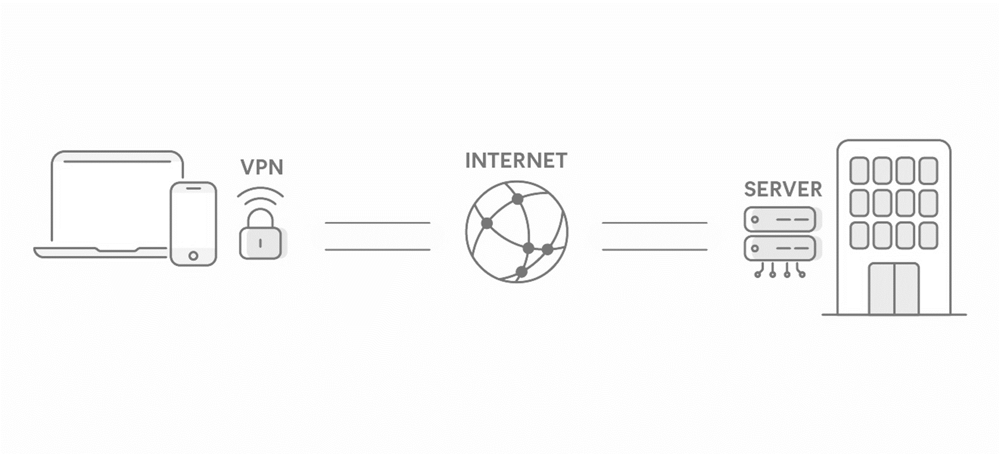

About VPN - What is VPN?!

A VPN, or Virtual Private Network, is a technology that allows you to create a secure connection over the Internet. It enables users to send and receive data as if their devices are directly connected to a private network, even if they are accessing the internet through a public network. The primary purpose of a VPN is to enhance privacy and security by encrypting the data that is transmitted between your device and the VPN server.

Key aspects of VPNs:

1. **Privacy and Anonymity:** VPNs encrypt your internet traffic, making it difficult for third parties such as hackers, ISPs (Internet Service Providers), or government agencies to intercept and decipher your data. This helps protect your privacy and makes it harder for anyone to trace your online activities back to you.

2. **Secure Data Transmission:** The encryption used by VPNs ensures that the data exchanged between your device and the VPN server is secure. This is especially important when using public Wi-Fi networks, where the risk of data interception is higher.

3. **Bypassing Geo-restrictions:** VPNs can allow you to access content that may be restricted or blocked based on your geographical location. By connecting to a server in a different location, you can appear as if you are accessing the internet from that region.

4. **Remote Access:** VPNs are commonly used by businesses to provide secure remote access for employees who need to connect to the company's internal network from outside locations. This is often referred to as a VPN tunnel.

5. **Circumventing Censorship:** In regions where internet access is restricted or censored, VPNs can be used to bypass such restrictions, allowing users to access blocked websites and services.

To use a VPN, you typically need to subscribe to a VPN service provider, install their software or configure the VPN settings on your device, and connect to one of their servers. Keep in mind that while VPNs provide enhanced privacy and security, they are not a panacea, and users should still practice good online security habits.

