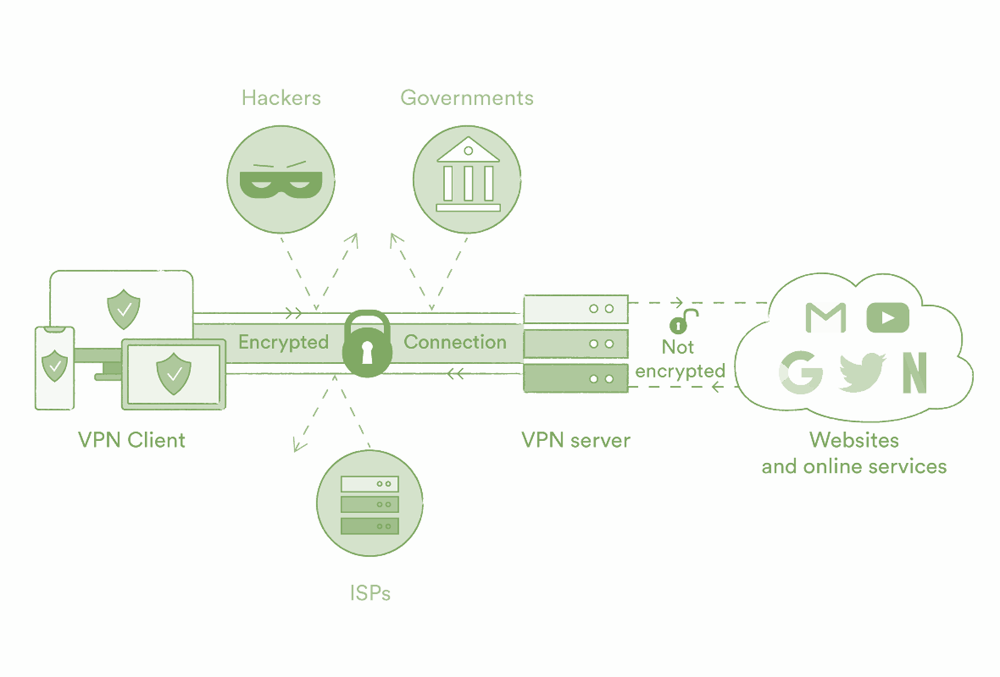

Why using VPN?!

People use VPNs for various reasons, and the choice to use a VPN depends on individual needs and concerns. Common reasons why individuals and businesses use VPNs:

1. **Enhanced Privacy:**
   - **Encrypting Internet Traffic:** VPNs encrypt the data transmitted between your device and the VPN server, making it more difficult for third parties to intercept and decipher your communications.
   - **Anonymous Browsing:** VPNs can mask your IP address, making it harder for websites and online services to track your online activities.

2. **Security on Public Wi-Fi:**
   - When using public Wi-Fi networks, such as in cafes, airports, or hotels, VPNs add an extra layer of security by encrypting your internet traffic. This helps protect sensitive information from potential hackers on the same network.

3. **Bypassing Geo-restrictions:**
   - VPNs enable users to access content that may be restricted based on geographical location. By connecting to a server in a different region, users can appear as if they are accessing the internet from that location.

4. **Circumventing Censorship:**
   - In countries with internet censorship or restrictions, VPNs can be used to access blocked websites and services by making the user's location appear elsewhere.

5. **Secure Remote Access:**
   - Businesses often use VPNs to provide secure remote access for employees who need to connect to the company's internal network from outside locations.

6. **Online Anonymity:**
   - Some individuals use VPNs to maintain a higher level of online anonymity. While not foolproof, VPNs can help mask the user's IP address and make it more challenging to trace their online activities.

7. **Protecting Against ISP Tracking:**
   - VPNs can prevent Internet Service Providers (ISPs) from monitoring and tracking your online activities. This is particularly relevant in regions where ISPs may be required to log user data.

8. **Secure File Sharing:**
   - VPNs provide a secure way to share files and collaborate over the internet, especially for businesses that need to transmit sensitive information.

It's important to note that while VPNs offer increased privacy and security, they are not a guarantee of complete anonymity, and users should still be mindful of other privacy practices and potential vulnerabilities. Additionally, the legal and regulatory aspects of using VPNs can vary by country, so users should be aware of the laws in their jurisdiction.

