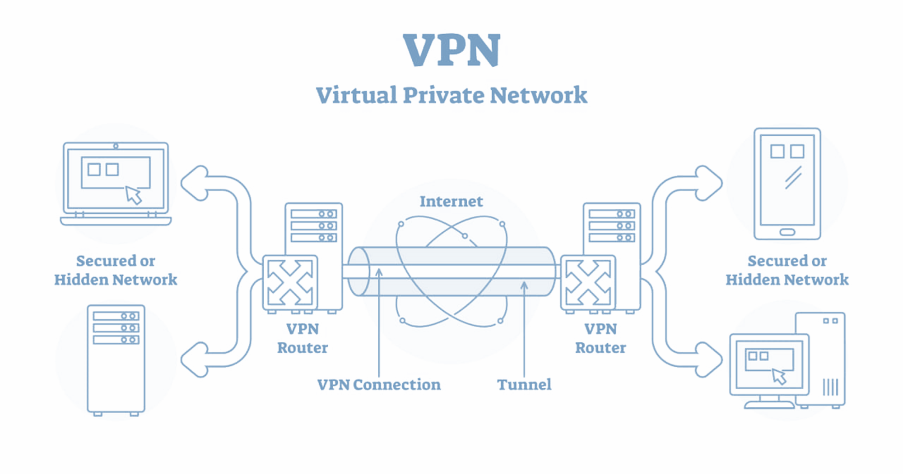

About VPN Protocols

VPN protocols are sets of rules and processes that define how data is transmitted and encrypted between devices and a VPN server. Different VPN protocols offer varying levels of security, speed, and compatibility. Some common VPN protocols:

1. **OpenVPN:**
   - OpenVPN is an open-source and widely used VPN protocol known for its security and flexibility. It supports strong encryption and is platform-independent, making it compatible with various operating systems.

2. **L2TP/IPsec (Layer 2 Tunneling Protocol with IPsec):**
   - L2TP is often used in combination with IPsec to enhance security. While L2TP itself doesn't provide encryption, the addition of IPsec provides a secure tunnel for data transmission. L2TP/IPsec is commonly supported on various devices but can be slower than other protocols.

3. **IKEv2/IPsec (Internet Key Exchange version 2 with IPsec):**
   - IKEv2 is a protocol that handles the establishment of the VPN tunnel, and it is often paired with IPsec for encryption. It is known for quick reconnections and is suitable for mobile devices that may switch between networks.

4. **PPTP (Point-to-Point Tunneling Protocol):**
   - PPTP is one of the earliest VPN protocols and is known for its simplicity. However, it is now considered less secure compared to other protocols due to vulnerabilities. It's not recommended for sensitive data transmission.

5. **SSTP (Secure Socket Tunneling Protocol):**
   - SSTP is a Microsoft-developed protocol that uses SSL/TLS for encryption. It is designed to traverse firewalls easily and is primarily supported on Windows systems.

6. **WireGuard:**
   - WireGuard is a relatively new and lightweight open-source VPN protocol known for its simplicity and efficiency. It aims to provide better performance and security with a minimal codebase. WireGuard is gaining popularity for its speed and modern design.

7. **SoftEther:**
   - SoftEther is an open-source VPN protocol that supports multiple VPN protocols within a single VPN server. It offers flexibility and compatibility with various devices.

The choice of VPN protocol depends on factors such as the level of security required, device compatibility, and speed considerations. OpenVPN and IKEv2/IPsec are commonly recommended for a balance of security and performance, but the optimal protocol may vary based on specific use cases and preferences. It's worth noting that some VPN services allow users to choose their preferred protocol, while others automatically select the best option based on the device and network conditions.

In addition to the more commonly used VPN protocols mentioned earlier, there are a few other protocols that are less widespread but still worth noting:

1. **Chameleon:**
   - Chameleon is a proprietary VPN protocol developed by VyprVPN. It is designed to help users bypass VPN blocking and throttling by disguising VPN traffic as regular HTTPS traffic. This can be particularly useful in regions where VPN usage is restricted.

2. **StealthVPN:**
   - StealthVPN is a protocol developed by TorGuard. Similar to Chameleon, it is designed to bypass VPN blocking and deep packet inspection (DPI) by making VPN traffic less detectable. It uses various obfuscation techniques to appear as regular internet traffic.

3. **Shadowsocks:**
   - Shadowsocks is not a traditional VPN protocol but is often used to achieve similar goals. It is a proxy protocol that allows users to bypass internet censorship and access blocked content. Shadowsocks is known for its simplicity and efficiency.

4. **Socks5:**
   - SOCKS (Socket Secure) is a general-purpose proxy protocol that can be used for routing traffic through a proxy server. While not a VPN protocol per se, it is sometimes used in conjunction with VPNs to enhance security and privacy.

5. **TLS/SSL:**
   - While SSL/TLS is commonly used in conjunction with VPN protocols like OpenVPN and SSTP for encryption, it can also be used as a standalone protocol for securing web-based communication. For example, HTTPS (HTTP Secure) uses TLS/SSL to encrypt data transmitted over the web.

It's important to note that the effectiveness and security of these protocols can vary, and some may be more suitable for specific use cases, such as overcoming censorship or bypassing network restrictions. When choosing a VPN service, it's essential to consider not only the protocol but also the overall security features, privacy policy, and reputation of the VPN provider. Additionally, the landscape of VPN protocols may evolve over time as new technologies and standards emerge.

What about GRE and IPIP?!

Both GRE (Generic Routing Encapsulation) and IPIP (IP in IP) are tunneling protocols used for encapsulating and transporting packets over a network. While they are not VPN protocols in the traditional sense, they are often used in conjunction with VPNs or other networking scenarios.

1. **GRE (Generic Routing Encapsulation):**
   - GRE is a tunneling protocol that allows the encapsulation of a wide variety of network layer protocols into point-to-point or multipoint connections. It's often used in scenarios where routing information needs to be transported between two networks. GRE doesn't provide encryption or security features on its own, so it's commonly used in combination with other protocols like IPsec to create secure VPN tunnels.

2. **IPIP (IP in IP):**
   - IPIP is another tunneling protocol that encapsulates IP packets within IP packets. It's a simple and lightweight protocol that doesn't provide encryption or security features by default. Like GRE, IPIP is often used in conjunction with other security protocols, such as IPsec, to create secure communication channels.

While GRE and IPIP can be used to create tunnels between networks, they lack the built-in encryption and security features found in many dedicated VPN protocols. In VPN scenarios, these protocols are often used as the transport layer, and additional encryption (such as IPsec) is layered on top to ensure the confidentiality and integrity of the transmitted data.

It's worth noting that the choice of tunneling protocol often depends on the specific requirements of the network and the devices involved. In many cases, modern VPN protocols like OpenVPN or IKEv2/IPsec are preferred due to their built-in security features and widespread support.

