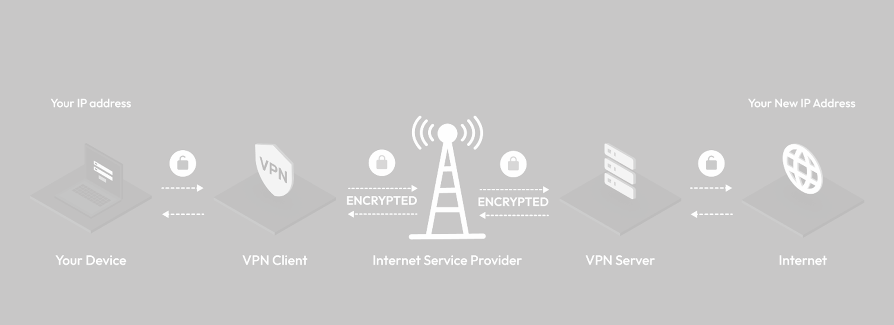

What is V2Ray and Shadowsocks and VMess?

V2Ray is an open-source project that provides a set of tools for building your own private network. It's designed to improve upon and extend the functionality of the original Shadowsocks project, which was created to bypass internet censorship. V2Ray is often used to create virtual private networks (VPNs) and to enhance privacy and security when accessing the internet.

Key features of V2Ray include:

1. **Versatility:** V2Ray is known for its flexibility and versatility. It supports multiple protocols, including VMess, Shadowsocks, SOCKS, and others, allowing users to choose the most suitable protocol for their needs.

2. **Security:** V2Ray includes encryption to secure the communication between the client and the server. The VMess protocol, in particular, is designed to provide strong encryption and security.

3. **Traffic Obfuscation:** V2Ray has features for traffic obfuscation, making it more challenging for network administrators to detect and block the use of V2Ray. This is particularly useful in regions with strict internet censorship.

4. **Pluggable Architecture:** V2Ray is built with a modular and pluggable architecture, allowing developers to easily add or extend features. This makes it adaptable to various use cases and scenarios.

5. **Cross-Platform Support:** V2Ray is compatible with multiple operating systems, including Windows, macOS, Linux, iOS, and Android. This cross-platform support makes it accessible to a wide range of users.

6. **Community Support:** V2Ray has an active and growing community of developers and users who contribute to its development and share their experiences. This community support can be valuable for troubleshooting and staying up-to-date with the latest developments.

It's important to note that while V2Ray can be a powerful tool for enhancing privacy and bypassing censorship, users should be aware of the legal and ethical considerations of using such technology. Additionally, the use of VPNs and similar tools may be subject to legal restrictions in certain jurisdictions. Always ensure that your use of such tools complies with local laws and regulations.

The legality and restrictions surrounding the use of V2Ray or any similar technology vary significantly from one jurisdiction to another. In some regions, using virtual private networks (VPNs) or tools like V2Ray may be entirely legal and commonly used for privacy, security, and overcoming internet censorship. In other places, there may be restrictions or even outright bans on the use of such tools.

Here are some key points to consider:

1. **Legal Status:** Check the legal status of VPNs and related technologies in your country. Laws and regulations can change, and the legality of VPN usage may depend on factors such as the purpose of use, the specific features of the VPN, and the local legal framework.

2. **Censorship and Restrictions:** In some countries, VPNs and tools like V2Ray are restricted or banned as part of government efforts to control and monitor internet access. Users in these regions may face legal consequences for attempting to bypass such restrictions.

3. **Terms of Service of Service Providers:** Even if the use of VPNs is legal in your country, it's important to consider the terms of service of the specific VPN or V2Ray service provider you choose. Some providers may have restrictions on certain activities or may prohibit the use of their services for specific purposes.

4. **Privacy Concerns:** Understand the privacy implications of using a particular VPN or tunneling service. Ensure that the service provider has a clear privacy policy and does not log or store sensitive user data.

5. **Corporate or Institutional Policies:** If you are using VPNs in a corporate or institutional setting, be aware of any policies or guidelines regarding the use of such tools. Some organizations may have specific rules governing the use of external network services.

It's crucial to research and understand the legal landscape in your specific location and to exercise caution when using VPNs or similar technologies. If you have concerns about the legality of using V2Ray or other VPN tools, it may be advisable to consult with legal experts familiar with the laws in your jurisdiction. Always prioritize compliance with local laws and regulations to avoid potential legal consequences.

What about Shadowsocks and VMess?

Shadowsocks and VMess are both protocols used for creating secure, encrypted communication channels over the internet. They are often employed to bypass internet censorship, enhance privacy, and secure data transmission. Let's take a closer look at each:

1. **Shadowsocks:**
   - **Overview:** Shadowsocks is an open-source proxy protocol designed to provide secure and private internet access. It was initially developed to help users in China overcome the Great Firewall and access blocked content.
   - **Functionality:** Shadowsocks operates by creating a SOCKS5 proxy server on the user's device. The protocol encrypts the data and routes it through the proxy server, making it appear as regular internet traffic. This can help users access blocked content and maintain privacy.
   - **Encryption:** While Shadowsocks provides encryption, it's essential to note that the level of security may vary based on the chosen encryption method. Users often configure Shadowsocks with additional encryption tools, such as SSL/TLS, to enhance security.

2. **VMess (Versatile Secure Socket):**
   - **Overview:** VMess is a protocol developed by the V2Ray project, designed to be a versatile and secure communication protocol. V2Ray is an open-source project that extends the functionality of the original Shadowsocks project.
   - **Functionality:** VMess is a more advanced protocol compared to Shadowsocks, providing features like multiplexing, traffic obfuscation, and enhanced security. It supports various types of communication scenarios, including point-to-point and point-to-multipoint connections.
   - **Encryption:** VMess employs strong encryption, making it a secure option for transmitting data. The protocol is often used in conjunction with other technologies, such as TLS, to provide additional layers of security.

Both Shadowsocks and VMess aim to help users bypass internet censorship and protect their online privacy. However, VMess, being a more recent and versatile protocol, offers additional features and capabilities. The choice between Shadowsocks and VMess may depend on individual preferences, specific use cases, and the level of security and functionality required.

It's important to note that the use of these protocols should comply with local laws and regulations, and users should be aware of the legal and ethical considerations surrounding the use of tools designed to circumvent internet censorship.

